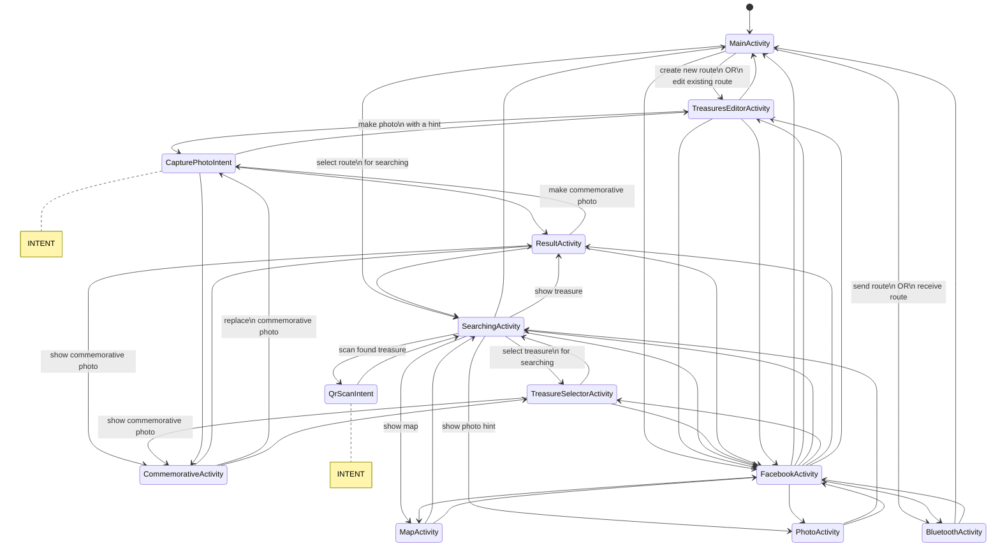
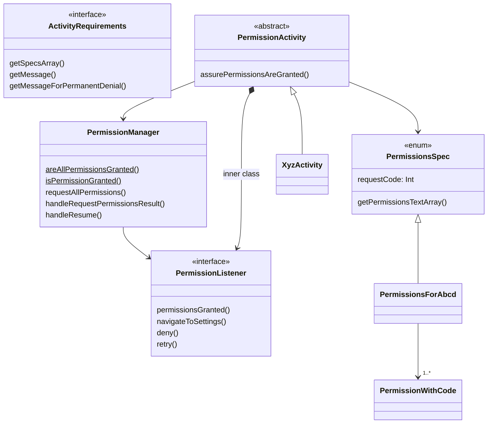
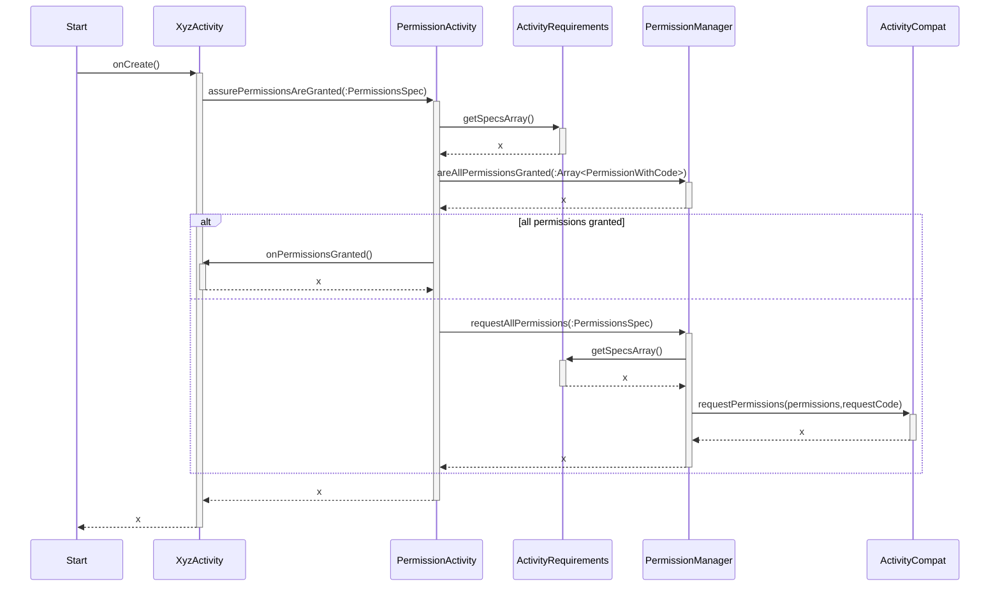
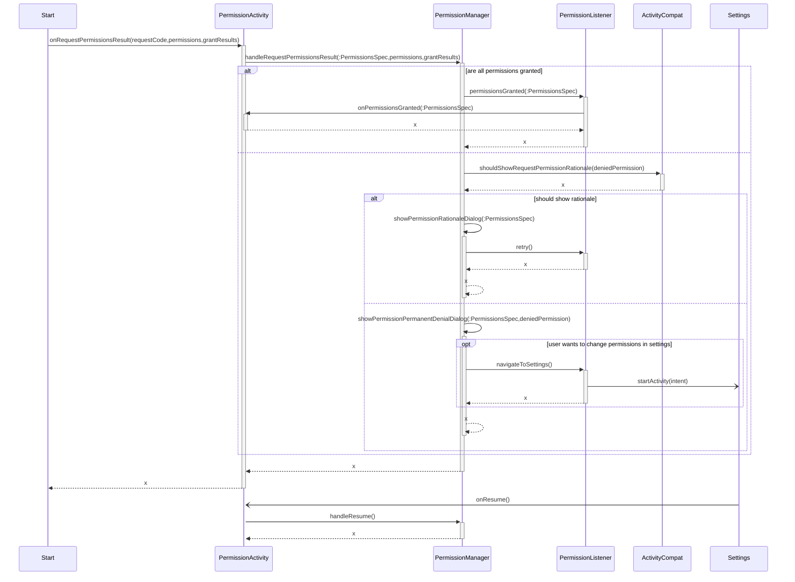
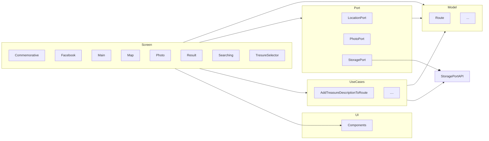

# Development environment configuration

To ~/.gradle/gradle.properties add:

```
MAPBOX_DOWNLOADS_TOKEN = <token>
FACEBOOK_TOKEN = <token>
```

Both tokens can be obtained from KeePass.
When using gradle directly the token can be delivered as a parameter: `-PMAPBOX_DOWNLOADS_TOKEN=<token>` or `-PFACEBOOK_TOKEN=<token>`.

# Activities flow



# Persistence management

There are three levels of state persistence.

1. **View Model level.** There is the ViewModel class that allows data to survive configuration changes such as screen rotations. 
Each stateful activity has a view model class (a class extending the `ViewModel`).

2. **Saved instance state.** Data saved this way survives system initiated process death (e.g. removing the process due to lack of memory). Saving instance state should be done
   through view model. The view model class aggregates an instance of the `SavedStateHandle`. When the data is changed, the view model should
   call `SavedStateHandle.set(variable, value)` (
   the map syntax can be used too).  
   When initializing the view model, available data should be loaded from `SavedStateHandle.get()`.

3. **Persistent storage.** To save data that should remain available till the user decides to remove it. It should by done through serialization to XML and then saving to disc
   using the `StorageHelper` class. The data that supposed to be saved should be wrapped by the view model, and the view model should handle its lifecycle. The view model should be
   aware of changes in such data and persist it immediately after the change.

# Permissions

Solution based on:

- https://medium.com/@rzmeneghelo/how-to-request-permissions-in-jetpack-compose-a-step-by-step-guide-7ce4b7782bd7
- https://stackoverflow.com/questions/60608101/how-request-permissions-with-jetpack-compose
- https://google.github.io/accompanist/permissions/
- https://github.com/google/accompanist/tree/main/sample/src/main/java/com/google/accompanist/sample/permissions

The permission is requested on the screen there it is needed for the first time.
What permission is needed is declared by implmenting the `Requirement` interface.
Implementation shall deliver three values:

- the actual permission from the `Manifest.permission` class
- message to be displayed when the permission is denied
- predicate that checks if the permission is needed on the current device

The permissions are handled using the functions from `Permissions.kt`.

In case a screen requires multiple permissions, they are requested one by one.
The callback form first permission is called when user answers to the request for granting permission and is used to
record in state that now the second permission should be requested.
The logic is delivered in the `PermissionsHandler` class.

## Structure



## Requesting permissions



## Handling request permission result



Rejecting required permissions should result in a dialog where user can change his/her mind. Permissions can be rejected "permanently", then the settings need to be visited to
grant permissions.

# Variants

Build variants (https://developer.android.com/build/build-variants) are used to create different variants of the app.
It's a solution based on product flavors.
On top of the predefined `release` and `debug` flavors are defined the following custom flavors:
- classic
   - defaultAssets
- custom
  - kalinowice
  - ...

That leads, thanks to the `variantFilter` configuration as well as `mode` and `assets` dimension from build.gradle, to the following variants:
  - kalinowiceCustomDebug
  - kalinowiceCustomRelease
  - defaultAssetsClassicDebug
  - defaultAssetsClassicRelease

In order to refer to one of the variant, for instance to execute unit tests, one need to execute:
```
$ ./gradlew testCustomDebugUnitTest
```
The above line will execute tests from the "custom" flavors as well as from the "unflavoured" source set, i.e. src/test.


# Source sets

For each flavor there has been created a source set with the same name as the flavor.
There are also dedicated test source sets with the `test` prefix, i.e. `test<flavor>`
Note that the source sets contains not only source code but also resources and assets.
The pattern is not followed for the instrumented UI tests.
For those tests, the source set directory name has and `androidTest` prefix followed by all flavors required to have a vaild build variant, e.g. `androidTestKalinowiceCustomDebug`.
In order to execute such tests you need and a running emulator, and then execute:
```
$ ./gradlew connectedKalinowiceCustomDebugAndroidTest
```

# Internal dependencies



The arcs show dependencies.
Model should not depend on anything.
Use cases may depend only on the model and possibly on port APIs (that can be an interface or a potential interface).
Screens are on top of the dependencies tree and may depend on anything.
However, internally should have some structure.
Only frontend code depends on the UI.
The frontend code should maximize usage of state and minimize coupling to ViewModel, while only the ViewModels should depend on ports and use cases.
Ports should wrap all external dependencies to make it possible to mock them in tests.

# Releasing

## Production release

1. Update `versionCode` and `versionName` in `app/build.gradle`.
2. Build -> Generate Signed Bundle/APK -> Android App Bundle -> ${variantName}Release
3. Google Play Console: Testuj i publikuj -> Test Otwarty -> Utworz nową wersję
3. Google Play Console: Testuj i publikuj -> Przegląd wersji -> Panel wersji ->  Utwórz nową wersję
4. Google Play Console: Pakiety aplikacji -> Prześlij (upload the aab file from app/variantName/release/)

To build aab file execute:

```bash
./gradlew bundle -PFACEBOOK_TOKEN=<token> -PMAPBOX_DOWNLOADS_TOKEN=<token> -PRELEASE_KEY_PASSWORD=<pass> -PRELEASE_STORE_PASSWORD=<pass>
```

To build apk file execute:

```bash
./gradlew assembleRelease -PFACEBOOK_TOKEN=<token> -PMAPBOX_DOWNLOADS_TOKEN=<token> -PRELEASE_KEY_PASSWORD=<pass> -PRELEASE_STORE_PASSWORD=<pass>
```

All tokens and passwords available in KeePass.

## Choosing version

Execute `./gradlew copy_config -Pconfig_src=VERSION` where VERSION is one of directories containing version configuration files, located in `assets/`.
E.g.:
```bash
./gradlew copy_config -Pconfig_src=kalinowice
```