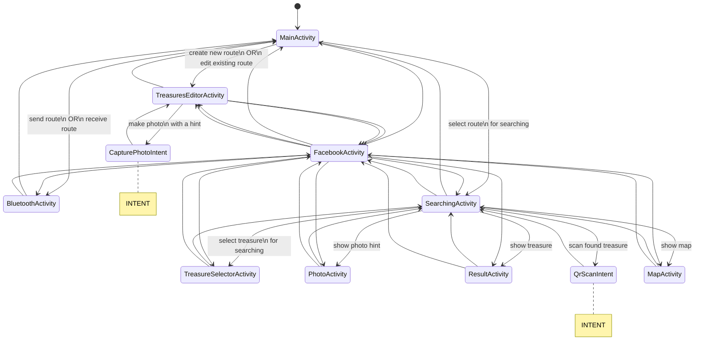
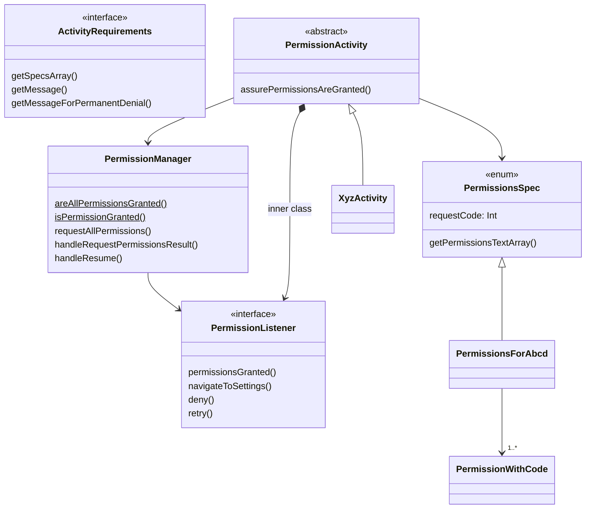
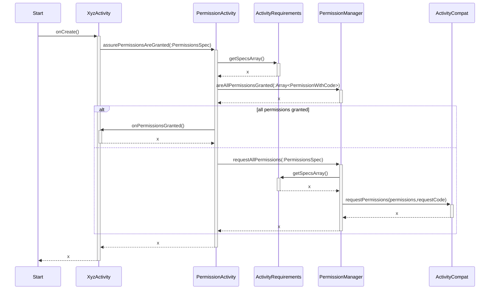
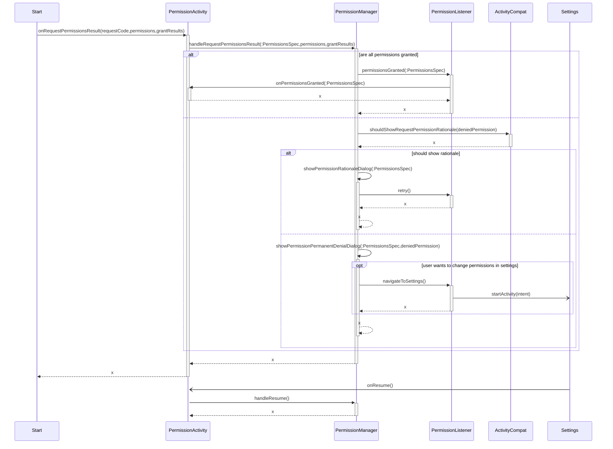

# Development environment configuration

To ~/.gradle/gradle.properties add:

```
MAPBOX_DOWNLOADS_TOKEN = <token>
FACEBOOK_TOKEN = <token>
```

Both tokens can be obtained from KeePass.
When using gradle directly the token can be delivered as a parameter: `-PMAPBOX_DOWNLOADS_TOKEN=<token>` or `-PFACEBOOK_TOKEN=<token>`.

# Activities flow



# Persistence management

There are three levels of state persistence.

1. **View Model level.** There is the ViewModel class that allows data to survive configuration changes such as screen rotations. Each stateful activity has a view model class (a
   class
   extending the `ViewModel`).

2. **Saved instance state.** Data saved this way survives system initiated process death (e.g. removing the process due to lack of memory). Saving instance state should be done
   through view model. The view model class aggregates an instance of the `SavedStateHandle`. When the data is changed, the view model should
   call `SavedStateHandle.set(variable, value)` (
   the map syntax can be used too).  
   When initializing the view model, available data should be loaded from `SavedStateHandle.get()`.

3. **Persistent storage.** To save data that should remain available till the user decides to remove it. It should by done through serialization to XML and then saving to disc
   using the `StorageHelper` class. The data that supposed to be saved should be wrapped by the view model, and the view model should handle its lifecycle. The view model should be
   aware of changes in such data and persist it immediately after the change.

# Permissions

## Structure



## Requesting permissions



## Handling request permission result



Rejecting required permissions should result in a dialog where user can change his/her mind. Permissions can be rejected "permanently", then the settings need to be visited to
grant permissions.

# Releasing

To build aab file execute:

```
./gradlew bundle -PFACEBOOK_TOKEN=<token> -PMAPBOX_DOWNLOADS_TOKEN=<token> -PRELEASE_KEY_PASSWORD=<pass> -PRELEASE_STORE_PASSWORD=<pass>
```

To build apk file execute:

```
./gradlew assembleRelease -PFACEBOOK_TOKEN=<token> -PMAPBOX_DOWNLOADS_TOKEN=<token> -PRELEASE_KEY_PASSWORD=<pass> -PRELEASE_STORE_PASSWORD=<pass>
```

All tokens and passwords available in KeePass.

## Old releasing procedure

You need to push a tag to create a release. Execute:

```
git tag
```

to check existing tags (only the local ones will be printed).

To create a new release execute:

```
git tag -a X.Y -m "comment"
git push origin --tags
```

It will launch a pipeline instance that creates a new release.
