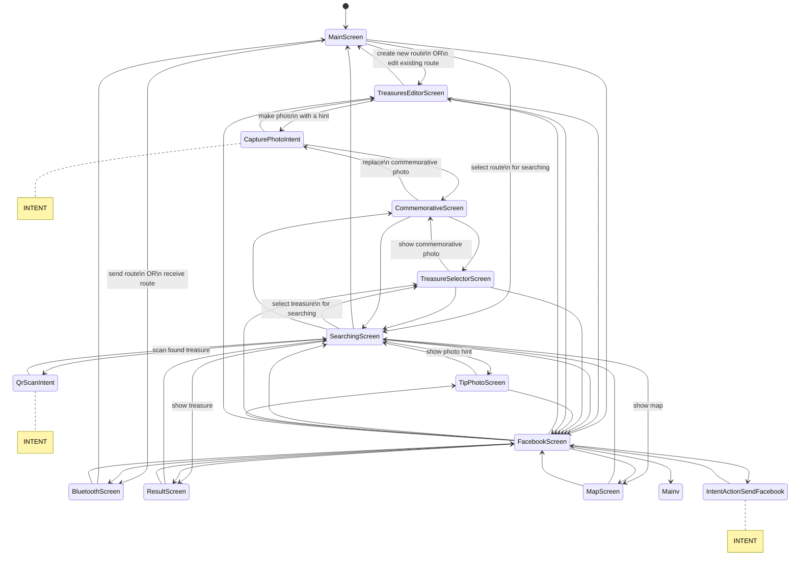
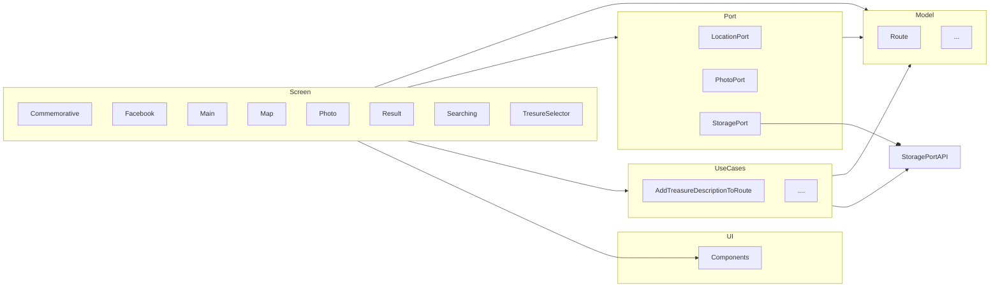

TODO:

- make all fields in states immutable
- remove layout/*.xml files
- is FACEBOOK_TOKEN still needed?

# Development environment configuration

To ~/.gradle/gradle.properties add:

```
MAPBOX_DOWNLOADS_TOKEN = <token>
FACEBOOK_TOKEN = <token>
```

When using gradle directly the token can be delivered as a parameter: `-PMAPBOX_DOWNLOADS_TOKEN=<token>` or `-PFACEBOOK_TOKEN=<token>`.

Create app/src/main/res/values/developer-config.xml file with the following content:

```xml

<resources>
    <string name="mapbox_access_token" translatable="false">TOKEN_VALUE</string>
</resources>
```

All tokens can be obtained from Keeper.

# Screens flow


```mermaid
   stateDiagram-v2
    [*] --> MainScreen
    MainScreen --> TreasuresEditorScreen : create new route\n OR\n edit existing route
    TreasuresEditorScreen --> MainScreen
    MainScreen --> BluetoothScreen : send route\n OR\n receive route
    BluetoothScreen --> MainScreen
    MainScreen --> SearchingScreen : select route\n for searching
    SearchingScreen --> MainScreen
    SearchingScreen --> TreasureSelectorScreen : select treasure\n for searching
    TreasureSelectorScreen --> SearchingScreen
    SearchingScreen --> TipPhotoScreen : show photo hint
    TipPhotoScreen --> SearchingScreen
    SearchingScreen --> ResultScreen : show treasure
    ResultScreen --> SearchingScreen
    SearchingScreen --> QrScanIntent : scan found treasure
    QrScanIntent --> SearchingScreen
    TreasuresEditorScreen --> CapturePhotoIntent : make photo\n with a hint
    CapturePhotoIntent --> TreasuresEditorScreen
    SearchingScreen --> MapScreen : show map
    MapScreen --> SearchingScreen
    TreasureSelectorScreen --> CommemorativeScreen : show commemorative photo
    CommemorativeScreen --> CapturePhotoIntent : replace\n commemorative photo
    CapturePhotoIntent --> CommemorativeScreen
    CommemorativeScreen --> TreasureSelectorScreen
    SearchingScreen --> CommemorativeScreen
    CommemorativeScreen --> SearchingScreen

    MainScreen --> FacebookScreen
    FacebookScreen --> Mainv
    TreasuresEditorScreen --> FacebookScreen
    FacebookScreen --> TreasuresEditorScreen
    BluetoothScreen --> FacebookScreen
    FacebookScreen --> BluetoothScreen
    SearchingScreen --> FacebookScreen
    FacebookScreen --> SearchingScreen
    TreasureSelectorScreen --> FacebookScreen
    FacebookScreen --> TreasureSelectorScreen
    TipPhotoScreen --> FacebookScreen
    FacebookScreen --> TipPhotoScreen
    ResultScreen --> FacebookScreen
    FacebookScreen --> ResultScreen
    TreasuresEditorScreen --> FacebookScreen
    FacebookScreen --> TreasuresEditorScreen
    MapScreen --> FacebookScreen
    FacebookScreen --> MapScreen
    FacebookScreen --> IntentActionSendFacebook
    IntentActionSendFacebook --> FacebookScreen
    
    
    note right of QrScanIntent: INTENT
    note right of CapturePhotoIntent: INTENT
    note right of IntentActionSendFacebook: INTENT
```

The transitions to `FacebookScreen` have a guard: `routeName.isBlank()`.
When it is not passed, the transition is blocked.

# Persistence management

There are three levels of state persistence.

1. **View Model level.** There is the ViewModel class that allows data to survive configuration changes such as screen rotations.
   Each screen has a view model class (a class extending the `ViewModel`).
   Additionally, some screens use the `SharedViewModel`.

2. **Saved instance state.** Data saved this way survives system initiated process death (e.g. removing the process due
   to lack of memory).
   Saving instance state should be done through view model.
   The view model class aggregates an instance of the `SavedStateHandle`.
   When the data is changed, the view model should call `SavedStateHandle.set(variable, value)` (the map syntax can be
   used too).  
   When initializing the view model, available data should be loaded from `SavedStateHandle.get()`.
   It is used sparely as usually either 1. is enough or 3. is required.
   When 3. is required it doesn't make much sense to additionally do 2.

3. **Persistent storage.** To save data that should remain available till the user decides to remove it.
   It should be done through serialization to XML and then saving to disc using the `StorageHelper` class.
   The data that supposed to be saved should be wrapped by the view model, and the view model should handle its
   lifecycle.
   The view model should be aware of changes in such data and persist it immediately after the change.

# Permissions

Solution based on:

- https://medium.com/@rzmeneghelo/how-to-request-permissions-in-jetpack-compose-a-step-by-step-guide-7ce4b7782bd7
- https://stackoverflow.com/questions/60608101/how-request-permissions-with-jetpack-compose
- https://google.github.io/accompanist/permissions/
- https://github.com/google/accompanist/tree/main/sample/src/main/java/com/google/accompanist/sample/permissions

The permission is requested on the screen where it is needed for the first time.
What permission is needed is declared by implmenting the `Requirement` interface.
Implementation shall deliver three values:

- the actual permission from the `Manifest.permission` class
- message to be displayed when the permission is denied
- predicate that checks if the permission is needed on the current device

The permissions are handled using the functions from `Permissions.kt`.

In case a screen requires multiple permissions, they are requested one by one.
The callback form first permission is called when user answers to the request for granting permission and is used to
record in state that now the second permission should be requested.
The logic is delivered in the `PermissionsHandler` class.

# Variants

Build variants (https://developer.android.com/build/build-variants) are used to create different variants of the app.
This is accomplished using two **independent flavor dimensions**:

## Flavor Dimensions

### 1. Mode Dimension (`mode`)

Controls the app functionality:

- **`classic`**: Original app mode (read-only routes)
- **`custom`**: Custom app mode (users can create/customize treasure routes)

### 2. Assets Dimension (`assets`)

Controls which location-specific treasure data is bundled with the app:

- **`defaultAssets`**: Generic app with no pre-bundled location data (routes loaded dynamically)
- **`kalinowice`**: Pre-bundled with Kalinowice region treasure hunt data (13 routes)
- **`pegow`**: Pre-bundled with Pegow region treasure hunt data (12 routes)

Each flavor dimension contains its own source set with location-specific assets in `app/src/<flavorName>/assets/`.

## Valid Variants

Not all combinations are valid. The `variantFilter` in build.gradle blocks incompatible combinations:

- ❌ Blocked: `custom` + `defaultAssets` (doesn't make sense to have custom mode without regional data)
- ❌ Blocked: `classic` without `defaultAssets` (classic mode requires generic/default setup)

Valid variants produced:

- `defaultAssetsClassicDebug`
- `defaultAssetsClassicRelease`
- `kalinowiceCustomDebug`
- `kalinowiceCustomRelease`
- `pegowCustomDebug`
- `pegowCustomRelease`

## Running Tests

To execute unit tests for a specific variant:

For kalinowice custom:
```
$ ./gradlew testKalinowiceCustomDebugUnitTest
```

For classic:
```
$ ./gradlew testClassicDebugUnitTest
```

These commands execute tests from the variant-specific flavor source sets as well as from the shared `src/test` source
set.

# Source sets

For each flavor there has been created a source set with the same name as the flavor.
There are also dedicated test source sets with the `test` prefix, i.e. `test<flavor>`
Note that the source sets contains not only source code but also resources and assets.
The pattern is not followed for the instrumented UI tests.
For those tests, the source set directory name has and `androidTest` prefix followed by all flavors required to have a vaild build variant, e.g. `androidTestKalinowiceCustomDebug`.
In order to execute such tests you need and a running emulator, and then execute:
```
$ ./gradlew connectedKalinowiceCustomDebugAndroidTest
```

# Internal dependencies


```mermaid
graph LR
    subgraph UseCases
        AddTreasureDescriptionToRoute
        ....
    end

    subgraph Screen
        Commemorative
        Facebook
        Main
        Map
        Photo
        Result
        Searching
        TresureSelector
    end

    subgraph UI
        Components
    end

    subgraph Port
        LocationPort
        PhotoPort
        StoragePort
    end

    subgraph Model
        Route
        ...
    end

    StoragePort --o StoragePortAPI

    Screen --> Components
    Screen --> UseCases
    Screen --> Port
    Screen --> Model

    UseCases --> StoragePortAPI
    UseCases -->  Model

    Port --> Model
```

The arcs show dependencies.
Model should not depend on anything.
Use cases may depend only on the model and possibly on port APIs (that can be an interface or a potential interface).
Screens are on top of the dependencies tree and may depend on anything.
However, internally should have some structure.
Only frontend code depends on the UI.
The frontend code should maximize usage of state and minimize coupling to ViewModel, while only the ViewModels should depend on ports and use cases.
Ports should wrap all external dependencies to make it possible to mock them in tests.

# Releasing

## Production release

1. Update `versionCode` and `versionName` in `app/build.gradle`.
2. Build -> Generate Signed Bundle/APK -> Android App Bundle -> ${variantName}Release
3. Google Play Console: Testuj i publikuj -> Test Otwarty -> Utworz nową wersję
4. Google Play Console: Pakiety aplikacji -> Prześlij (upload the aab file from app/variantName/release/)
5. Wait for tests results... unless test are irrelevant; other test paths may be considered as well
6. Google Play Console: Testuj i publikuj -> Produkcyjna -> Utwórz nową wersję
7. Google Play Console: Pakiety aplikacji -> Choose from library the version submitted for "Test Otwarty"
8. Wait till google approves the new version which takes at least one day and publish once approved.

## Debug release

Build -> Generate Signed Bundle/APK -> APK

## Module release

The following example is given for the compass module.

To publish the compass module aar file to GitHub Packages execute (it embeds the assembleRelease task):

```bash
./gradlew :compass:publishReleasePublicationToGitHubPackagesRepository -PCOMPASS_VERSION=0.0.1
```

The maven-publish plugin exposes the release build variant of the module.

To only build the aar file execute:

```bash
./gradlew :compass:assembleRelease
```

### Authentication

Publishing to GitHub Packages additionally credentials.
The build resolves them in the following order (see the `credentials` block in `compass/build.gradle`):

1. `gpr.user` / `gpr.key` Gradle properties — read from `~/.gradle/gradle.properties`, a `-P` command-line
   parameter, or (in CI) the `GRADLE_PROPERTIES` secret,
2. falling back to the `GITHUB_ACTOR` / `GITHUB_TOKEN` environment variables.

In practice:

- Local computer: one-time setup — add to `~/.gradle/gradle.properties`:

  ```
  gpr.user=<github-login>
  gpr.key=<PAT with write:packages>
  ```

  **How to obtain the credentials:**

    1. **`gpr.user`** — your GitHub account login (username). No special setup needed; just use the same name you use to
       log into GitHub.
    2. **`gpr.key`** — a [Personal Access Token (PAT)](https://github.com/settings/tokens) with the `write:packages`
       permission:

        - Go to **GitHub → Settings → Developer settings → Personal access tokens → Tokens (classic)** (or "Fine-grained
          tokens" if preferred).
        - Click **Generate new token**.
        - For a classic token, select the **`write:packages`** scope (the `repo` scope is also commonly included but not
          strictly required for packages).
        - For a fine-grained token, under **Repository permissions** grant **Packages → Write** (and optionally *
          *Contents → Read** if the token also needs to fetch source).
        - Set an expiration and a descriptive note (e.g. "maly-poszukiwacz-skarbow compass publish").
        - Copy the generated token — it will be shown only once. This is the value for `gpr.key`.

       **Security notes:**
        - Treat the PAT like a password. Never commit it to the project `gradle.properties` (which is tracked by git) —
          always use `~/.gradle/gradle.properties` or a CI secret.
        - Rotate the PAT if it is ever exposed. GitHub lets you revoke tokens at any time from the same settings page.
        - The minimal scope for publishing is `write:packages`. If you also need to consume the package from the same
          machine (e.g. for a local consumer build), add `read:packages` as well.

- CI: nothing to configure — the publish workflow sets `GITHUB_ACTOR` / `GITHUB_TOKEN` automatically (the ephemeral
  token with the `packages: write` permission).

### Versioning

The version of the published artifact is managed as follows:

- By default it comes from the `COMPASS_VERSION` property in `gradle.properties` (currently `1.0.0`).
- To publish a different version without editing the file, override the property on the command line:

  ```bash
  ./gradlew :compass:publishReleasePublicationToGitHubPackagesRepository -PCOMPASS_VERSION=0.0.1
  ```

- GitHub Packages versions are immutable — an already published version cannot be overwritten, so re-running
  the command with the same version fails. Always use a new version for each publication. This applies to
  `-SNAPSHOT` versions as well — see _Publishing from a local computer_ below.
- After publishing, update `COMPASS_VERSION` in `gradle.properties` and commit it, so that the default version
  matches the released artifact and the next release starts from the right baseline.

### Automatic publishing (CI) — preferred

Push a git tag named `compass-v<version>` (e.g. `compass-v1.0.0`). The `Publish Compass Module` workflow
(`.github/workflows/publish_compass.yml`) runs the `:compass` unit tests and publishes the artifact to GitHub
Packages.

The workflow authenticates with the ephemeral `GITHUB_TOKEN` (`permissions: { contents: read, packages: write }`) —
publishing from this repository requires no Personal Access Token (PAT) and no stored secret. For the full
credentials resolution order (and the `gpr.*` precedence caveat) see _Authentication_ above.

### Publishing from a local computer

Publishing locally is useful for a work-in-progress build that a consumer can test before an official release.
Use a `-SNAPSHOT` version for such builds.

Prerequisites: complete the one-time credential setup described in _Authentication_ above.

Then:

1. Run the module's unit tests:

   ```bash
   ./gradlew :compass:test
   ```

2. Publish with an explicit `-SNAPSHOT` version, for example:

   ```bash
   ./gradlew :compass:publishReleasePublicationToGitHubPackagesRepository -PCOMPASS_VERSION=1.0.1-SNAPSHOT
   ```

Caveat: GitHub Packages does not implement Maven snapshot semantics — every version, including `-SNAPSHOT` ones,
is immutable, so the same version string can be published only once. For the next work-in-progress build change
the version string, e.g. `1.0.1-SNAPSHOT-2`, `1.0.1-SNAPSHOT-3`, etc.

### Consumer setup (e.g. nowy-poszukiwacz)

In the consumer's root `build.gradle`, inside `allprojects.repositories` (the same pattern as the Mapbox repository):

```groovy
maven {
    url 'https://maven.pkg.github.com/mjureczko/maly-poszukiwacz-skarbow'
    credentials {
        username = project.findProperty('gpr.user')
        password = project.findProperty('gpr.key')
    }
}
```

then depend on the module:

```groovy
implementation 'pl.marianjureczko.poszukiwacz:compass:1.0.0'
```

Auth caveat: GitHub Packages requires authentication even for public packages. A consumer living in a different
repository (like nowy-poszukiwacz) needs a PAT with `read:packages`, stored as `gpr.user` / `gpr.key` in the
consumer's `~/.gradle/gradle.properties` or its CI secrets — the publisher's `GITHUB_TOKEN` cannot be reused.
